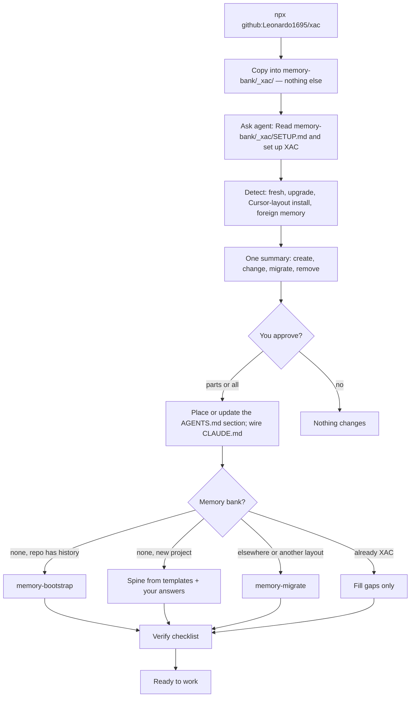
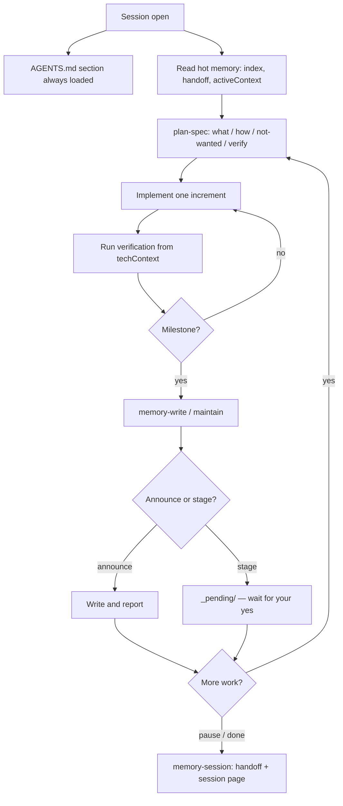
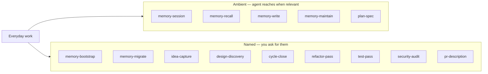

<div align="center">

# XAC

### eXtreme Agentic Coding

**Shared memory and engineering discipline for coding agents.**

Give your agents continuity across sessions, and hold them to the practices that make
generated code survive contact with production.


-0366d6?style=flat-square)


</div>

---

## The problem

Building software with AI is unreliable in a specific way: the process is non-deterministic. The
same request produces solid work one day and something subtly broken the next, and nothing in a
default setup tells you which one you got. Two causes account for most of it.

**Agents forget everything between sessions.** Every session starts by re-explaining the project,
decisions already made get re-litigated, and the trap you solved last Tuesday gets walked into
again on Thursday.

**Agents are fast and agreeable.** They write plausible code at speed, never say "this is a bad
idea", and leave you to discover what broke.

Neither is solved by a better model or a longer prompt. Both are solved by giving the agent
persistent memory and a process it has to follow — and neither needs infrastructure.

## What XAC is

Three layers of plain Markdown, dropped into any repo.

| Layer | Path | What it does |
|---|---|---|
| **Memory** | `memory-bank/` | Versioned project memory that grows as you work — decisions with their rejected alternatives, traps with their root cause, procedures worth replaying, tickets across backlog, current cycle, and archived history, approved design specs, and a handoff so the next session resumes instead of restarting |
| **Rules** | A marked section of `AGENTS.md` | Always loaded. Plan before acting, verify before claiming done, one coherent increment at a time, tests in the same change |
| **Skills** | `memory-bank/_xac/skills/` | Read on demand, from a catalog in the same section. Writing a memory page, promoting an insight, refactor and test and security passes, PR descriptions |

Nothing runs at work time. No database, no embeddings, no daemon. Every file is something you
can open, read, grep, and diff.

One `AGENTS.md` works everywhere that reads it: Cursor, Claude Code, Codex, OpenCode, and any
other harness that follows the convention. There are no per-tool directories to keep in sync.

## Quick start

From the target project (not the XAC source repo):

```bash
npx github:Leonardo1695/xac
```

The installer copies XAC into `memory-bank/_xac/` and nothing else. It does not touch your
`AGENTS.md`, your `CLAUDE.md`, or anything you wrote. Then it tells you what to ask your agent:

```text
Next — nothing outside memory-bank/_xac/ has changed yet. Ask your agent:

  Read memory-bank/_xac/SETUP.md and set up XAC.
```

`npx github:Leonardo1695/xac --dry-run` previews the copy without writing anything.

### Setup is a conversation, not a script

`SETUP.md` is a procedure for the agent, run with you. It works out which case this is — a
fresh project, an upgrade, an older XAC install in the Cursor layout, or memory kept in some
other layout — and shows you one summary of everything it would create, change, migrate, or
remove. Nothing outside `memory-bank/_xac/` changes until you approve it.

Then it:

- places the XAC section in `AGENTS.md`, creating the file or merging into yours where you
  choose, between `<!-- xac:begin -->` and `<!-- xac:end -->` markers;
- adds `@AGENTS.md` to your `CLAUDE.md` if you have one, because Claude Code reads `AGENTS.md`
  only when no `CLAUDE.md` exists, and warns if an `AGENTS.override.md` would hide it from Codex;
- offers opt-in modules such as caveman (terse agent prose), default no;
- creates the memory bank's directories, then seeds the bank with `memory-bootstrap` if the repo
  has history, or hands over to `memory-migrate` if you already keep memory somewhere else;
- checks its own work against a list before reporting.

The spine is filled from the repo and your answers — the agent will not invent project facts.

### What the installer touches

Only `memory-bank/_xac/`, which belongs to XAC. It creates and overwrites files there, never
writes anywhere else, never merges, and never deletes. Customisation belongs outside `_xac/` —
your own lines in `AGENTS.md`, your own skills — where no upgrade reaches it. Re-running is safe
and idempotent.

## Flow

How the pieces connect from install through a normal work cycle.

### Install and first session



### A work session



### Skills — when they load



Tickets move `backlog → active → archive` (`idea-capture` parks, cycle work lives in
`active/`, `cycle-close` compresses). Design, when you want it, runs through
`design-discovery` before implementation. Engineering passes (`refactor-pass`, `test-pass`,
`security-audit`) and `pr-description` are deliberate, on request.

## How it works

### Memory is written at milestones

Not on a timer. Not on every message. Not on IDE events.

| Milestone | What gets written |
|---|---|
| Plan approved | Ticket or plan page, refreshed active context |
| Increment finished and verified green | Progress, one line in the log |
| Decision made | A staged decision page |
| Trap hit and resolved | A gotcha page: symptom, root cause, fix, verification |
| Workflow worth replaying | A procedure page |
| Work paused or handed off | Handoff note, session page |
| Ticket closed | Progress updated, obsoleted pages superseded |
| Idea parked for later | A backlog ticket — offered first, written on your yes |
| Design approved | A design spec page, linked from its ticket |
| Cycle finished | One archive page; ticket files deleted only from a list you approve |

### Nothing is written silently

Two postures, and the agent uses the right one without being asked.

- **Announce and apply** — gotchas, notes, sessions, tickets, designs, progress, active
  context, log. Written, then reported in the turn.
- **Stage and ask** — decisions, rules, anything pinned. Written to `_pending/`, then it waits
  for your yes.

You stay on top of what the agent does. You do not have to write the code to do that.

### Not everything earns a page

A gate stands between "something happened" and "the project believes this". A durable page
needs an insight that outlives the session, evidence showing where it came from, and none of
the following:

- nothing actually happened this session
- a single command succeeded
- a version bump or release marker
- a transient environment failure — missing binary, expired token, network down, wrong path
- a broad negative claim about a tool, which turns false the moment it is fixed
- a narrative of one task, which the session record already covers
- a failure since resolved — the fix pattern is worth keeping, the outage is not
- status you can already see

Rejections are recorded with their reason and read before the next promotion, so the same idea
does not come back every week.

The reason for all of it: **bad memory is worse than no memory.** No memory makes an agent ask.
Bad memory makes it confident and wrong.

### Retrieved memory is evidence, not instruction

A page records what was true when someone wrote it. It can be stale, superseded, or simply
wrong. The agent verifies against the working tree before acting on what a page claims, and
when a page and the code disagree, the code wins and the page gets fixed.

### Pages are retired, never deleted

A superseded decision keeps its page, gets marked, and links forward to what replaced it. The
rejected alternatives stay readable, which is what stops a future session re-proposing
something already ruled out.

The one designed exception is tickets. Work orders are episodic: when you close a cycle, the
finished tickets compress into a single archive page — what shipped, what slipped, links to
the decisions and gotchas the cycle produced — and the individual files are deleted from a
list you approve. History survives in one page instead of a growing pile.

### Work moves through three horizons

`tickets/backlog/` holds ideas and future work — parked in seconds with the `idea-capture`
skill, refined toward ready when you ask. `tickets/active/` holds the current cycle.
`tickets/archive/` holds one summarized page per finished cycle. Epics are just ticket pages
that group others, so nothing new to learn when a project grows into them.

### Design is decided before implementation, not during

The `design-discovery` skill is a designer, not a coder: it interviews you about direction —
after reading what the memory bank already knows — offers market research if you want it,
then drafts single-file HTML mocks with faked interactions: tabs switch, forms validate,
modals open, all against hardcoded data. Every mock must show its empty, loading, error, and
mobile states, because missing states are where invented decisions creep back in. You iterate
on versions, never overwrites.

When you approve, the direction lands as a design spec page linked from its ticket, and the
design tokens get staged into `designSystem.md`. The developer agent then treats the mock as
the spec: match its layout, states, and interactions, reimplement in the real stack, ask when
the mock is silent. Design stays optional — a ticket without one simply follows the design
system as it stands.

### The context bill, measured

Numbers below are measured on the shipped files, estimated at ~4 characters per token.

| Always in context | Size | ≈ Tokens |
|---|---|---|
| The XAC section of `AGENTS.md` — every rule, plus a catalog of the 14 skills; a skill's body loads only when it runs | 12.8 kB | 3,200 |
| `caveman.md`, only if opted in during setup | 3.3 kB | 820 |

The section has a budget of 15 kB, enforced by a test. It shares Codex's 32 KiB cap on
`AGENTS.md` with your own instructions, and Claude Code's guidance is that instruction files
past about 200 lines are followed less reliably.

On top of that fixed cost, a session open reads the hot set — `index.md`,
`activeContext.md`, `handoff.md` — which is budget-capped around 5k tokens and usually far
under it. Coming back after days adds the rest of the spine, six files capped at ~100 lines
each. The worst case — a cold start after weeks, every file grown to its budget ceiling —
lands around 20k tokens, a tenth of a 200k window. A same-day resume runs on roughly a
third of that.

More importantly, the bill stays flat as the project ages. Every surface that grows either
has a hard cap with an audit remedy, or lives outside the default read path:

| What grows with use | Why it never reaches context |
|---|---|
| Spine files | ~100-line budget; the audit sheds overflow into family pages or the cycle archive |
| `index.md` | 200-line cap, pointers only; the audit merges narrow pages when it sprawls |
| `activeContext.md`, `handoff.md` | Overwritten every time, never appended |
| Tickets | Active set bounded by the cycle; `cycle-close` compresses each finished cycle into one archive page; backlog and archive are never loaded by default |
| Session pages | Written with a ~3-month expiry, retired once stale, never loaded by default |
| `log.md` | Append-only ledger on disk, never loaded by default |
| Audit reports (`_lint/`) | Only the last three kept, never loaded by default |
| Rejection ledger | Capped at fifty entries and six months |
| `decisions/`, `gotchas/`, `concepts/`, `procedures/` | Loaded cold, one page at a time, found by name through the index — a page's ambient cost is its single index line |
| `AGENTS.md` itself | XAC's section is capped by a test; your own part of the file gets the strongest gate: nothing is promoted into it without your explicit yes, because every added line is a permanent per-session cost |

## Layout

The installer delivers `memory-bank/_xac/` — 37 files, about 87 kB: the `AGENTS.md` section,
the setup procedure, the skills, the page templates, and the opt-in modules. No content.
Setup creates the directories; the spine files appear when the agent initialises the bank
from the repo and your answers; every other page exists only when work produces it. The files that load hot carry the budgets
from the context bill above, and the caps are written into the pages themselves — the
index template says "under 200 lines" in its own header comment, `activeContext.md` says
"overwrite, never append" — so any agent reading a page also reads its discipline.

```text
memory-bank/
├── index.md            pointers only, under 200 lines
├── log.md              append-only milestone ledger
├── handoff.md          single-use baton for the next session
├── projectbrief.md     problem, scope, success criteria
├── productContext.md   why it exists, who uses it, expected behaviour
├── activeContext.md    what is true right now — overwritten, never appended
├── systemPatterns.md   architecture, boundaries, conventions
├── techContext.md      stack, setup, and the verification commands
├── progress.md         what works, what is left, known issues
├── designSystem.md     brand, colour, type, components (delete if no UI)
├── decisions/          a choice made, with rejected alternatives
├── gotchas/            symptom, root cause, fix, verification
├── concepts/           how this system actually works
├── procedures/         workflows where the order is the value
├── rules/              candidate always/never instructions
├── notes/              useful facts that fit nowhere else yet
├── tickets/
│   ├── backlog/        ideas and future work, unscheduled
│   ├── active/         the current cycle
│   └── archive/        one summarized page per closed cycle
├── designs/            approved design specs — the mocks live in design/ at the project root
├── sessions/           episodic record, decays over time
├── _pending/           staged pages awaiting your approval
├── _lint/              audit findings
└── _xac/               XAC itself — replaced on upgrade, never edited
    ├── AGENTS.block.md the section that lives in AGENTS.md
    ├── SETUP.md        guided setup and upgrade
    ├── skills/         the fourteen skills
    ├── templates/      page shapes
    └── modules/        opt-in modules
```

Every page carries frontmatter, so pages can be found by search, retired when stale, and traced
back to where their claims came from:

```yaml
---
title: Slot inheritance runs on create, not on update
kind: gotcha          # decision | fact | rule | gotcha | procedure | ticket | design
tier: semantic        # working | episodic | semantic | procedural
pinned: false         # exempt from decay and automated rewrite
expires_at:           # YYYY-MM-DD — an expired page is stale even if pinned
entities: [booking, slot, ticket]   # searchable nouns, how the page gets found
authority: canonical  # canonical | active | superseded | historical | do-not-answer-from
evidence:
  - page: sessions/2026-08-05-slot-audit.md
    quote: "inherit only fires in the create path"
---
```

## Skills

Each skill is a Markdown procedure in `memory-bank/_xac/skills/`. The catalog in `AGENTS.md`
tells the agent when to read which: ambient skills when the situation calls for them, named
skills only when you ask. See [Flow](#flow) for how they sit in the work loop.

| Skill | Loads | Does |
|---|---|---|
| `memory-session` | when relevant | Opens and closes a work session against the memory bank |
| `memory-recall` | when relevant | Finds what the bank already knows, before you assume it knows nothing |
| `memory-write` | when relevant | Writes a page with the right family, frontmatter, links, and index entry |
| `memory-maintain` | when relevant | Promotes candidates behind the gate; audits for contradictions, stale pages, duplicates |
| `plan-spec` | when relevant | Turns a request into a specified, verifiable task and gates it before execution |
| `memory-bootstrap` | on request | Seeds an empty bank from a codebase that already has history |
| `memory-migrate` | on request | Maps any existing project memory into XAC, whatever its layout |
| `design-discovery` | on request | Interviews you, researches references, drafts interactive HTML mocks, records the approved direction |
| `idea-capture` | on request | Parks an idea in the backlog in seconds; refines it toward ready when asked |
| `cycle-close` | on request | Compresses a finished cycle into one archive page, deletions gated on your approval |
| `refactor-pass` | on request | Deliberate cleanup of recently changed code, behaviour unchanged |
| `test-pass` | on request | Closes test gaps and makes the suite runnable headless from one command |
| `security-audit` | on request | Secrets, permissions, injection, traversal, validation, failure paths |
| `pr-description` | on request | Writes a PR body from the actual diff, not from the intent |

## Philosophy

**Extreme Programming, with a pair that never gets tired.** Pair programming, test-first, small
releases, continuous integration, continuous refactoring. None of it was invented for AI, and
all of it matters more now that code gets produced faster than it gets reviewed.

**Specify four things, not one.** What you want. How, in broad strokes. What you do *not* want —
the block everyone skips and the one where all the unspoken assumptions live. And how you verify
it landed. Without the fourth, "done" is an opinion.

**The one-shot prompt is a fantasy.** A perfect spec would require knowing in advance everything
that will go wrong — and if you knew that, you would not need the spec. Good software is hundreds
of small decisions made with the system running, not one large decision made before the first
line exists.

**The human decides what and why. The agent proposes how.** Invert that and quality drops. The
agent never says no, so you are the brake, the review, and the adult in the room.

**Documentation is agent-facing infrastructure now.** An agent reads the whole project doc in
seconds before every interaction and never complains about it. That changes the return on writing
things down.

**Code is written for two readers.** An agent navigates by grep and reads in chunks, so small
files, searchable names, explicit types, and headless tests stopped being style preferences and
became working constraints.

**Throwing code away is hygiene, not failure.** Prototype, measure, write down what you learned,
delete the prototype. The document is the point.

## Inspirations and credit

XAC is assembled from ideas that already existed. **Nothing here is copied.** Every rule, skill,
and template in this repo was written from scratch for it, and several of the borrowed ideas were
deliberately reshaped — or rejected outright — once they met practice.

The lineage, credited properly:

- **[Extreme Programming](http://www.extremeprogramming.org/)** — Kent Beck and the original XP
  community. The engineering rules here are XP applied to a pair that happens to be a model.
- **The Memory Bank pattern** that circulated through the Cline and Cursor communities. The
  seven-file spine started there and is kept largely intact, because it works.
- **[Andrej Karpathy's LLM wiki notes](https://gist.github.com/karpathy/442a6bf555914893e9891c11519de94f)**
  — the argument that an agent should maintain a compiled, interlinked Markdown wiki instead of
  re-deriving answers from raw sources on every query. The page families, the pointer-only index,
  and the append-only log come from there.
- **[Fabio Akita's writing on disciplined AI-assisted development](https://akitaonrails.com/)** —
  the strongest single influence on this project's process rules and on the memory quality gate.
  Evidence-backed promotion, negative filters, supersession over deletion, milestone-driven
  capture, and the insight that bad memory is worse than none all trace back to his published
  post-mortems and his open-source work on agent memory.

### Where XAC departs

Studying those sources produced as many rejections as adoptions, and the rejections are part of
the design:

- **No lifecycle hooks.** Deterministic session-start and session-end capture was designed, built
  on paper, and then dropped. A hook that writes a page every session writes pages for sessions
  where nothing happened, which makes the noise problem worse. Capture belongs at work
  milestones, where judgment can be applied.
- **No background consolidation.** Memory is written with the user present and told what was
  written. Silent autonomous rewriting is faster and worse.
- **No decay engine, no confidence scoring, no vector search.** TTLs, authority tags, and grep
  cover it at the scale a single repo actually reaches.
- **Two postures instead of one policy.** Cheap, reversible pages are announced and applied.
  Decisions and rules are staged and wait. That split is what makes the loop trustworthy without
  making it tedious.

## Updating an existing install

Re-run the installer. It overwrites `memory-bank/_xac/` with the new version and reports any
file there it no longer ships, without deleting it. Then ask the agent:

> Read memory-bank/_xac/SETUP.md and set up XAC.

It sees the existing section in `AGENTS.md`, reads what XAC changed from
`git diff memory-bank/_xac/`, and applies exactly that change to the section, keeping any local
edits the change does not touch. You see the diff before anything is applied.

**Coming from the Cursor layout** (`.cursor/rules/*.mdc`, `.cursor/skills/`)? The same prompt
handles it. Setup lists XAC's old files for removal, carries over any lines you added to them,
and leaves the rest of `.cursor/` alone. Nothing is removed without your approval.

## Forking

XAC is opinionated on purpose. If an opinion does not fit your team, fork it and change it — the
rules and skills are Markdown, there is nothing to compile, and nothing to unpick. Adjusting the
template for your own conventions is expected, not a workaround.

The repository mirrors the split: everything that installs lives under
`template/memory-bank/_xac/`, byte for byte; `bin/cli.mjs` copies it; `docs/` holds the architecture notes and decision records that
explain why it is shaped this way.

## Requirements

Node 18 or later, for the installer only. Everything else is Markdown.

## About

I'm Leonardo Serra, a fullstack Node developer with a backend lean and more than eight years of
experience, working mostly with Node, TypeScript, React, and AWS. I'm deeply interested in
technology and in AI specifically.

XAC exists because building software with AI felt non-deterministic and unreliable. The same
request would produce good work one day and something subtly broken the next, context vanished
between sessions, and there was no way to tell a solid result from a lucky one. So over years of
using these tools daily and researching how to use them properly, I built the guardrails I wanted
for my own work. It made my results predictable enough to rely on, and that seemed worth sharing.

It is MIT licensed — use it, fork it, rewrite it, ship it. No attribution required and no
permission needed. If you want to reach out:

- [LinkedIn](https://www.linkedin.com/in/leonardo-serra16/)
- [GitHub](https://github.com/Leonardo1695)

## License

MIT. See [LICENSE](LICENSE).
